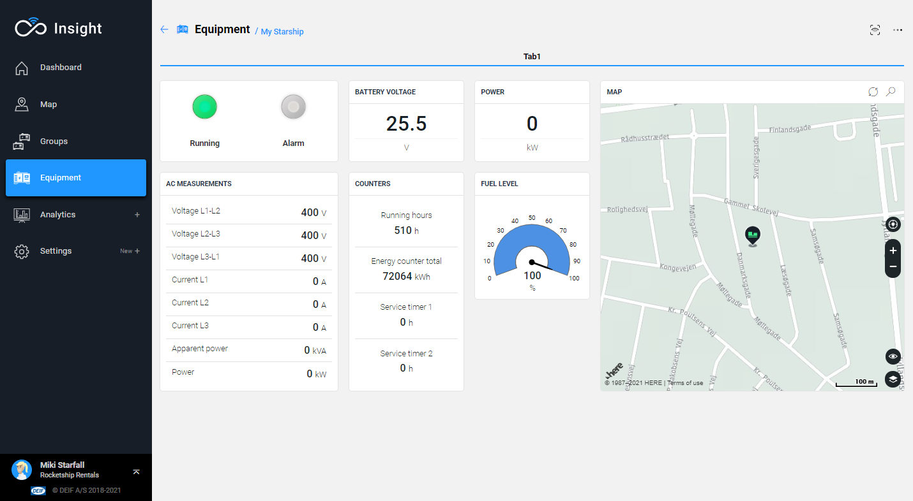

# Groups

## What are Groups?

Groups are a great way to organize equipment. 

Equipment may need to be organized in groups, for example, due to geographic distribution or if they are used together in a project. Insight Groups help you to streamline the processes of monitoring equipment, fetching data and delegating access.

## Adding Groups

Under Settings / Equipment, press the ... button on the top-right corner and select "Add Group". 

.png>)

Groups can be given a type. Group types are merely indicative and used for display purposes only.

After selecting a type, details such as name and description can be added. Equipment can then be linked to the group by clicking on "Attach Equipment".

.png>)

Select the Equipment from the list and Confirm.

.png>)

The selected equipment will show in the list.

.png>)

After saving, the new group appears in the Groups 

.png>)

