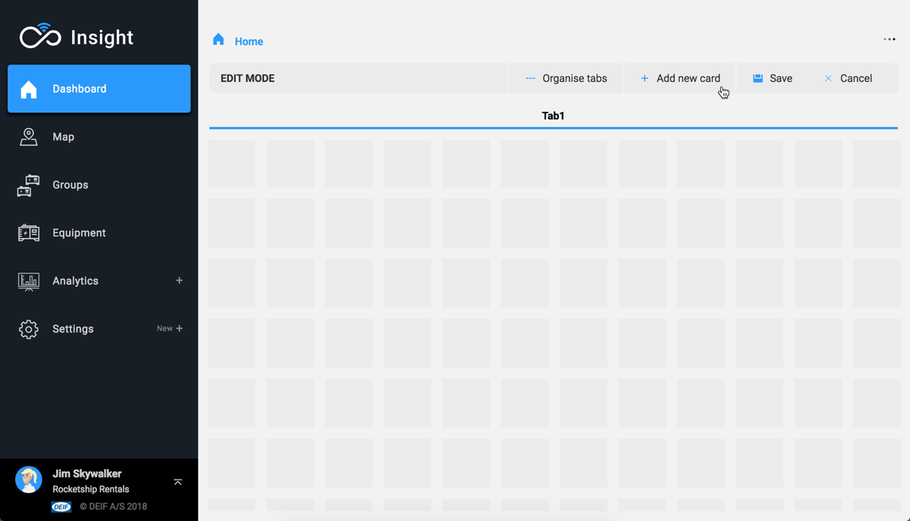

# Create your first dashboard

When landing on an empty dashboard, a pop-up is shown to allow immediate editing.

Alternatively, press the More \(...\) button on the top right corner and select "Edit dashboard".

