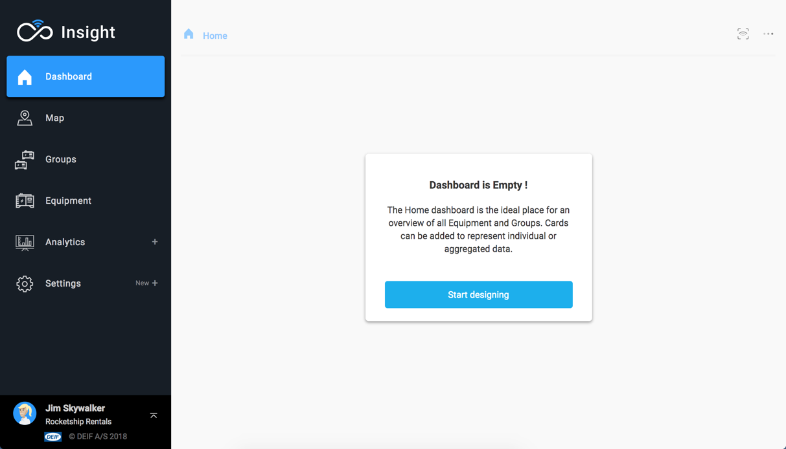
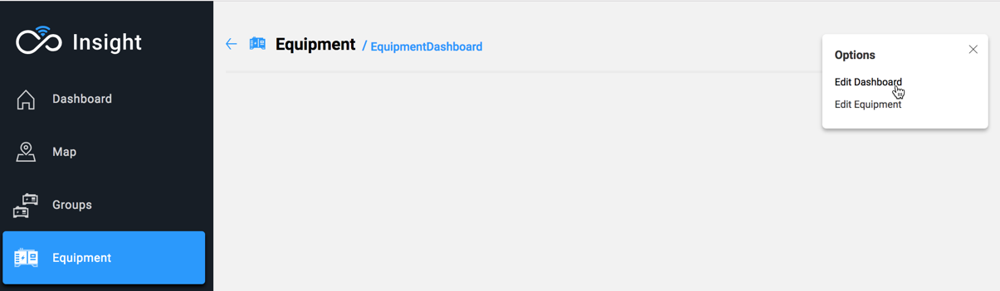
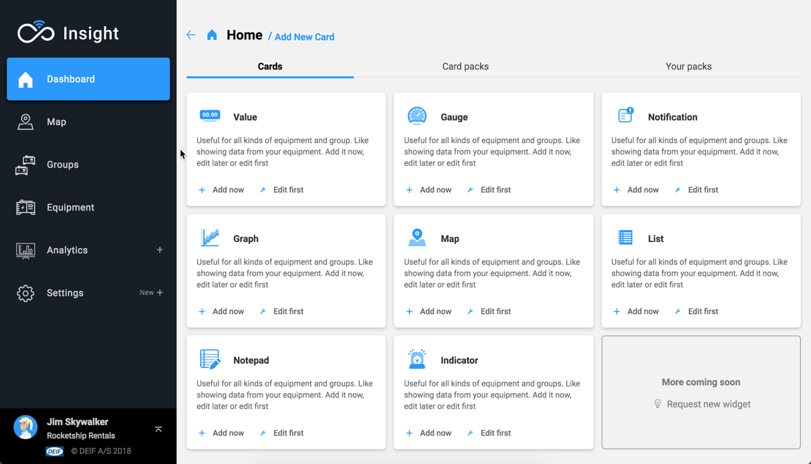
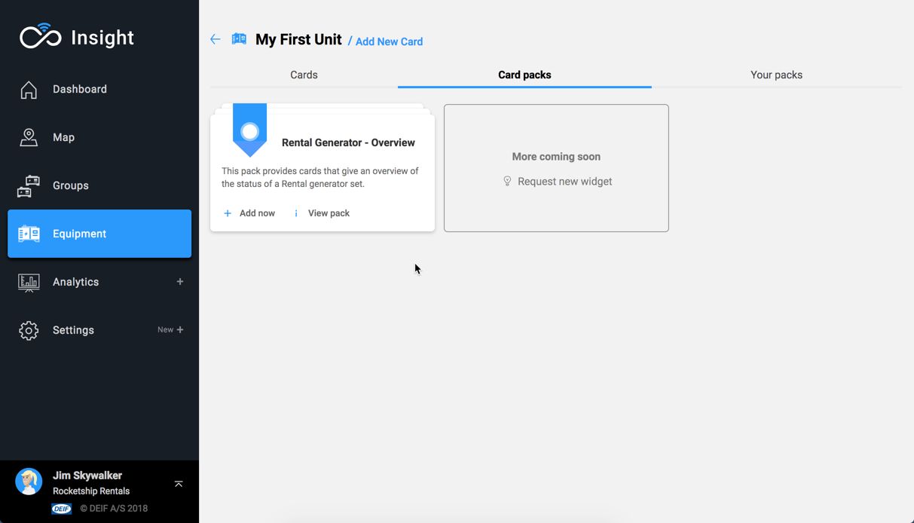
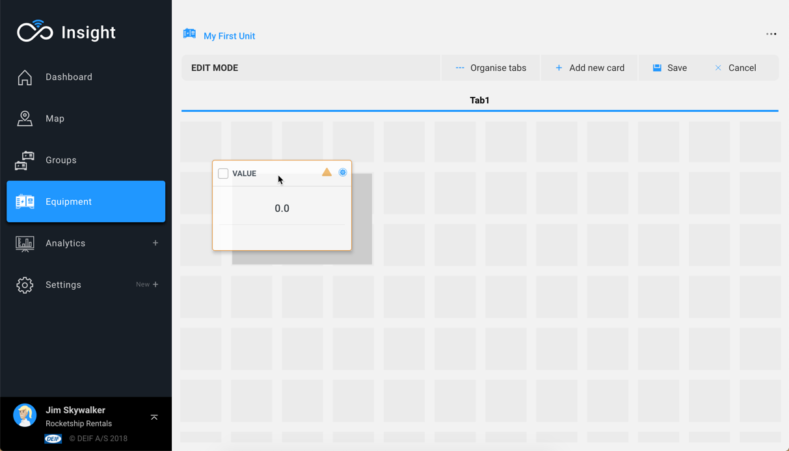
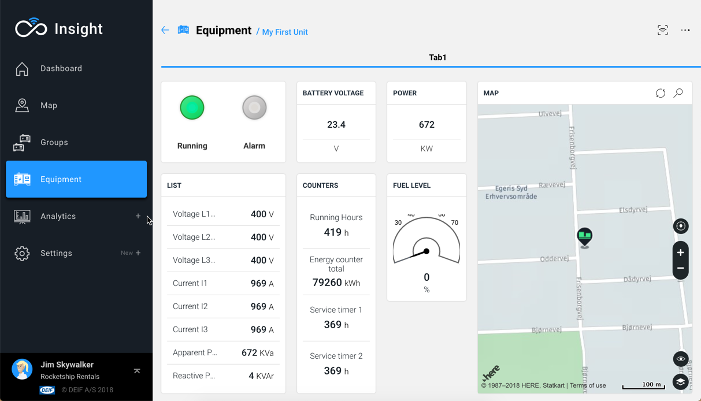

# Create your first dashboard

When landing on an empty dashboard, a pop-up is shown to allow immediate editing.

Alternatively, press the More \(...\) button on the top right corner and select "Edit dashboard".

## Adding content to the dashboard

Adding content to the dashboard is very easy.   
Simply press the "Add new card" button and choose from a variety of Cards and Card Packs.

### Add a Card

Each card has its own requirements in terms of configuration.  
Please note that Home and Group dashboards may introduce additional parameters to each card.

The **Add now** option creates a card with a default configuration.  
The **Edit first** option will open the card configuration page.   
Please note that some cards always require some configuration.

For more information please check:



### Add a Card Pack

Adding cards to a dashboard is fun, but we made it easy to add multiple cards in one simple action.  
Card packs are sets of pre-configured cards which can be added to a dashboard to provide instant value.


Each dashboard type has its own Card Packs.


### Move things around

In dashboard editor mode, the cards may be dragged and dropped freely around the dashboard.

## Finishing your work

To finish and apply the changes, press the **Save** button.   
Alternatively, you can **Cancel** which will revert back to the last saved dashboard configuration.


Your dashboard will soon display the data received from the device.


## See also





