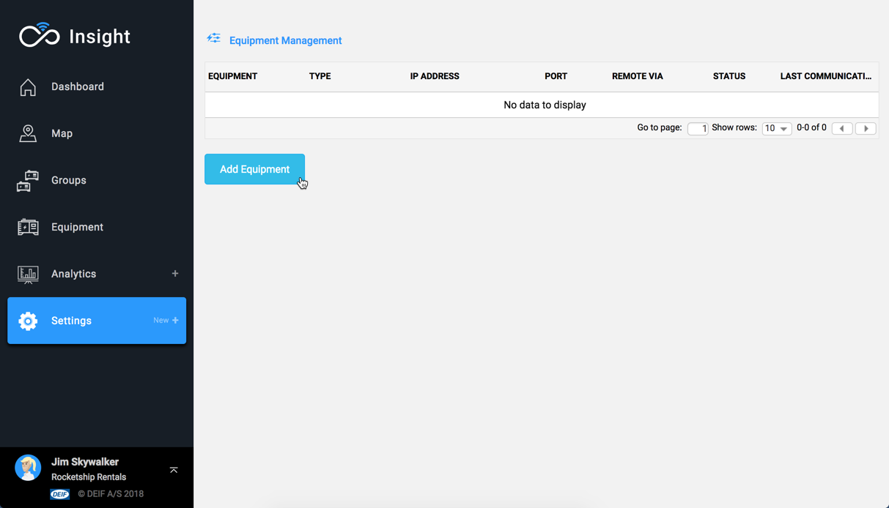
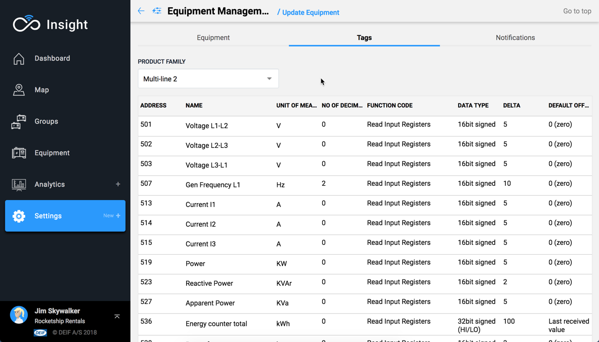
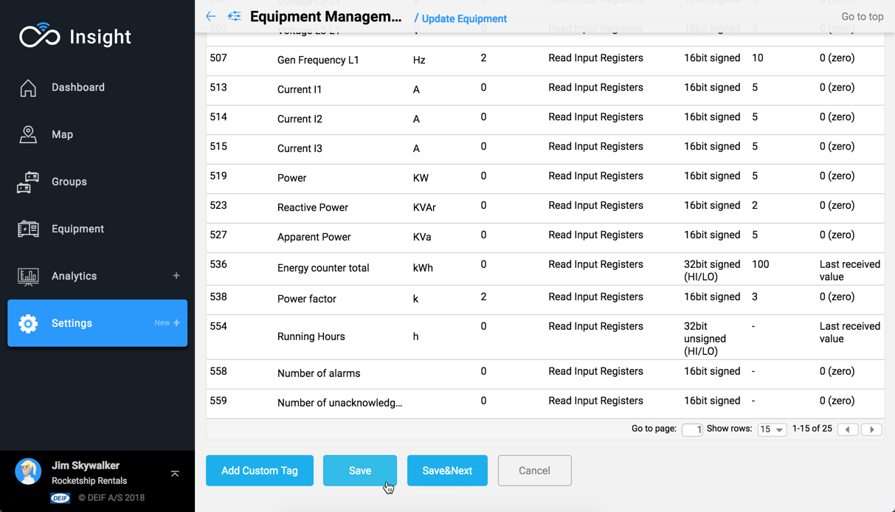
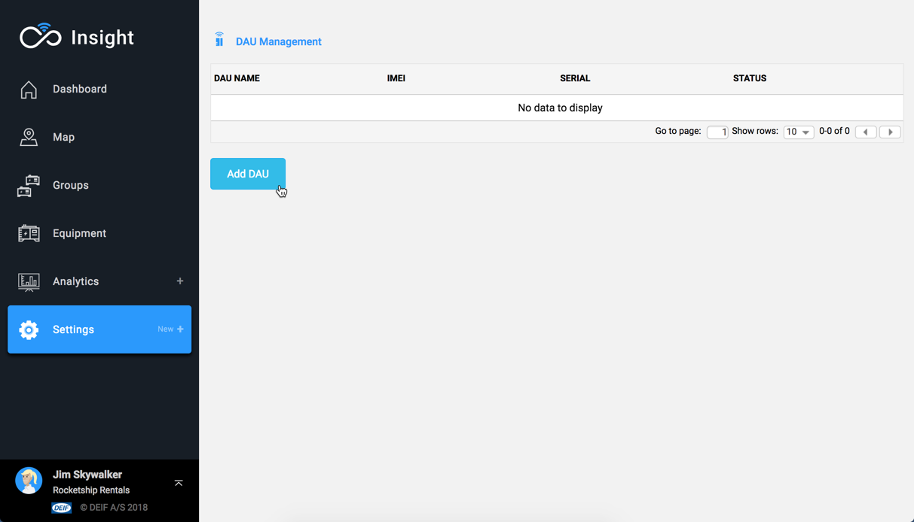
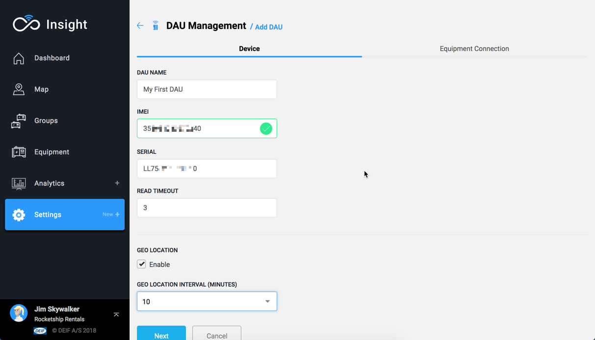
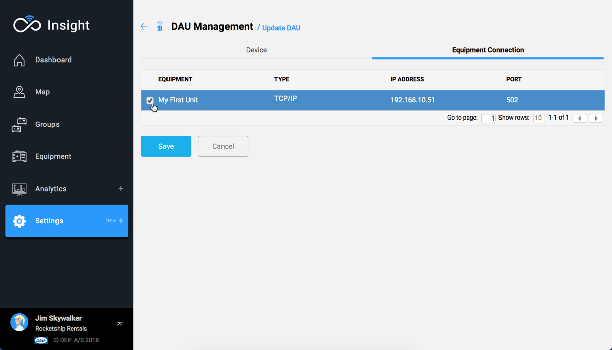

# Part 2: Insight setup

## Set up the Equipment

Log into the portal at `https://insight.deif.com`.

Follow **Settings =&gt; Equipment Management** from the navigation menu and then press the **Add Equipment** button.

### Enter Equipment details

Fill all required fields as a minimum.

<table>
  <thead>
    <tr>
      <th style="text-align:left">Control</th>
      <th style="text-align:left">Description</th>
      <th style="text-align:left">Required</th>
    </tr>
  </thead>
  <tbody>
    <tr>
      <td style="text-align:left">Status</td>
      <td style="text-align:left">Switch.
         Activate/Deactivate the Equipment.</td>
      <td style="text-align:left">No</td>
    </tr>
    <tr>
      <td style="text-align:left">Equipment Type</td>
      <td style="text-align:left">Locked field.
         Fixed as "Diesel genset".</td>
      <td style="text-align:left">No</td>
    </tr>
    <tr>
      <td style="text-align:left">Equipment Name</td>
      <td style="text-align:left">Entry field.
         The name by which the Equipment will be identified.</td>
      <td style="text-align:left">Yes</td>
    </tr>
    <tr>
      <td style="text-align:left">Equipment Model</td>
      <td style="text-align:left">
        
Entry field.

        
Information about the model of the Equipment.

      </td>
      <td style="text-align:left">Yes</td>
    </tr>
    <tr>
      <td style="text-align:left">Connection Type</td>
      <td style="text-align:left">
        
Dropdown.

        
See Note 1 below.

      </td>
      <td style="text-align:left">Yes</td>
    </tr>
    <tr>
      <td style="text-align:left">IP Address</td>
      <td style="text-align:left">
        
Entry field.

        
The IP address of the device

      </td>
      <td style="text-align:left">Yes</td>
    </tr>
    <tr>
      <td style="text-align:left">Unit ID</td>
      <td style="text-align:left">
        
Dropdown.

        
See Note 1 below.

      </td>
      <td style="text-align:left">No</td>
    </tr>
    <tr>
      <td style="text-align:left">Port</td>
      <td style="text-align:left">
        
Entry field.

        
Default at 502 - standard port for Modbus TCP.

      </td>
      <td style="text-align:left">Yes</td>
    </tr>
    <tr>
      <td style="text-align:left">Users</td>
      <td style="text-align:left">Multi-selection dropdown. See Note 2 below.</td>
      <td style="text-align:left">No</td>
    </tr>
    <tr>
      <td style="text-align:left">Teams</td>
      <td style="text-align:left">Multi-selection dropdown. See Note 2 below.</td>
      <td style="text-align:left">No</td>
    </tr>
  </tbody>
</table>¹ If you require to set a Modbus ID \(for example: when using Modbus TCP to Serial converter\), choose `Modbus RTU to TCP Converter` from the **Connection Type** dropdown. When **Connection Type** is set to `TCP/IP`, the Modbus ID is set to 3.

² Selecting users and teams is not very relevant at this stage.

### Define Product Family and Tags

The first step is to define the Product Family, for which there are two choices available. See below table.

<table>
  <thead>
    <tr>
      <th style="text-align:left">Product Family</th>
      <th style="text-align:left">Usage</th>
    </tr>
  </thead>
  <tbody>
    <tr>
      <td style="text-align:left">Multi-line 2 (Default)</td>
      <td style="text-align:left">
        
Set of predefined tags for the DEIF ML2 platform.

        
No extra effort is required.

      </td>
    </tr>
    <tr>
      <td style="text-align:left">None</td>
      <td style="text-align:left">
        
Set of predefined tag names for any Modbus platform.

        
Selecting None will clear all configured tags.

        
Non-configured tags will not be acquired from the device.

      </td>
    </tr>
  </tbody>
</table>

Setting up tags is not in the scope of this Quick Start Guide.  
For information on how to set up a tag, please follow the link below.



### Saving your Equipment configuration

Once the tag configuration is finished, the configuration may be saved and ended.

There is an optional step to Save and configure Notifications - **Save&Next** button.  
The configuration of Notifications is not part of the scope of this Quick Start Guide.



## Set up the DAU

To conclude the process, you will how need to register the DAU and link the Equipment that was created.

### Register DAU details


Quick Tip: If you kept DAU Configuration page open in your browser you can simply copy and paste the **IMEI** and **Serial Number** from one page to the other.


