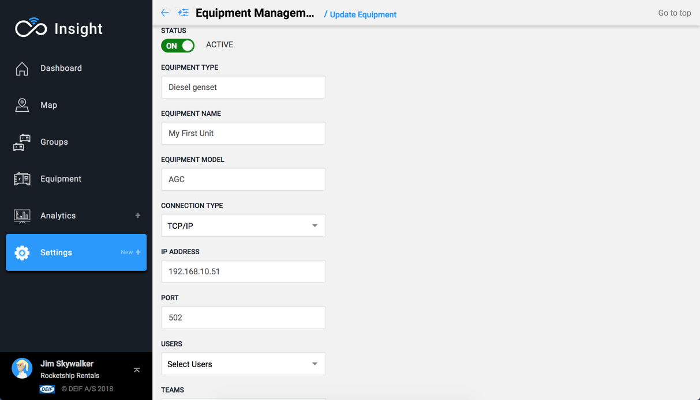

# Part 2: Insight setup

## Set up the Equipment

Log into the portal at `https://insight.deif.com`.

Follow `Settings => Equipment Management` from the navigation menu and then press the Add Equipment button.

## 

