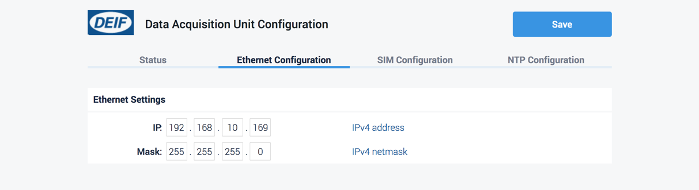
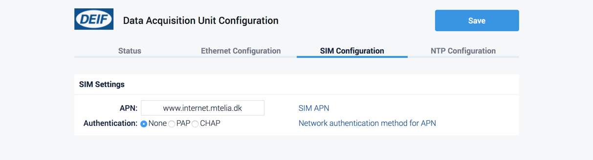

# Part 1: DAU setup

## Connect DAU to PC

1. Turn on the DAU.
2. Connect the micro-USB cable to the DAU and the computer.
3. Wait a few seconds until the network connection is established.
4. Open your browser and navigate to address `http://192.168.2.2`.

## Configure the DAU

lorem ipsum dolor...

### Configure network settings

When using the Ethernet variant of the DAU, it will be necessary to configure the network settings.  
This is necessary so that the DAU is in the same network as the device that will be monitored on Insight.


Switch the DAU OFF and ON again to restart with the new network settings.


### Configure APN settings


If the data session is already connected, skip this step.


The APN configuration is an important step without which no data sessions with the operator will be started.

In some occasions, the SIM card may configure the APN automatically.


Check the APN settings with your operator before proceeding.


Click on tab "SIM Configuration" and enter the APN settings.

